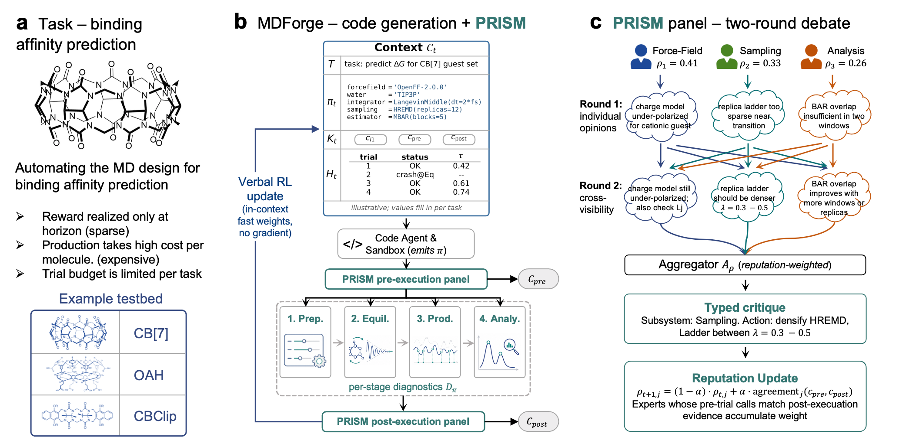

# MDForge

**Agentic molecular-dynamics pipeline design under sparse simulator feedback.**

Molecular dynamics (MD) is the canonical in-silico method for atomistic molecular science, but designing an MD pipeline for a new system demands expert knowledge, and a single run is too expensive for trial-and-error. MDForge is an LLM agent that automates this expert design process. Unlike MD agents that orchestrate a fixed toolbox, MDForge frames pipeline design as **open-ended code generation** refined online by **verbal reinforcement learning**: the Code agent writes the simulation pipeline from scratch (Python / OpenMM plus whatever helpers it chooses), and each trial's diagnostics reshape the next.



## PRISM: densifying the sparse reward

A full MD run yields one expensive scalar reward. **PRISM** (Process-Reward Interpretation via Subsystem Mediation) turns it into a dense, typed learning signal along two axes:

- **Per-stage diagnostics.** Execution proceeds through four canonical stages (Prep, Equilibration, Production, Analysis); physics-grounded diagnostics are harvested at each stage boundary, not only at the end of the run.
- **Multi-expert debate.** A panel of three physics specialists (force-field, sampling, analysis) debates the diagnostics over two rounds; a reputation-weighted aggregator emits one typed critique (subsystem + action) that feeds the next trial.

One trial: the **Code agent** emits a pipeline → **Layer 1** static-checks it → the **Engineer agent** debugs it in a sandbox → **Layer 3** runs the stages → the **Layer 2** panel critiques the diagnostics and benchmark result.

## Quickstart

```bash
pip install -e ".[dev,llm]"            # the agent's own env
bash   data/fetch.sh                    # fetch + build the SAMPL benchmark
bash   scripts/setup_pipeline.sh        # build pipeline/ MD env (AmberTools+OpenMM)
pytest                                  # 125 tests
bash   scripts/run_paper_all_hosts.sh   # full 3-host sweep (serial)
python scripts/run_heldout_eval.py      # best pipeline on held-out guests
```

Two environments are involved: the agent runs in the `pip install` env, while agent-written MD code executes in the separate `pipeline/` conda env (`environment.yml`; override its location with `PRISM_PIPELINE`). Set `ANTHROPIC_API_KEY`, or use the bundled `claude-agent-sdk` client. Each guest evaluation runs ~2 GPU-hours on a single A40.
